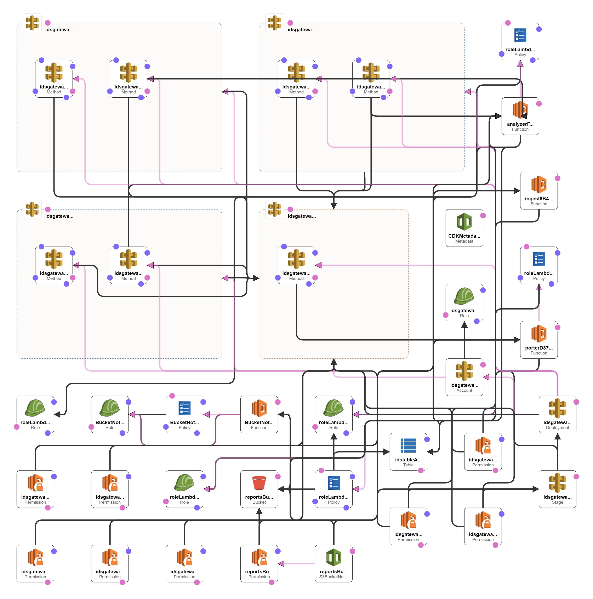
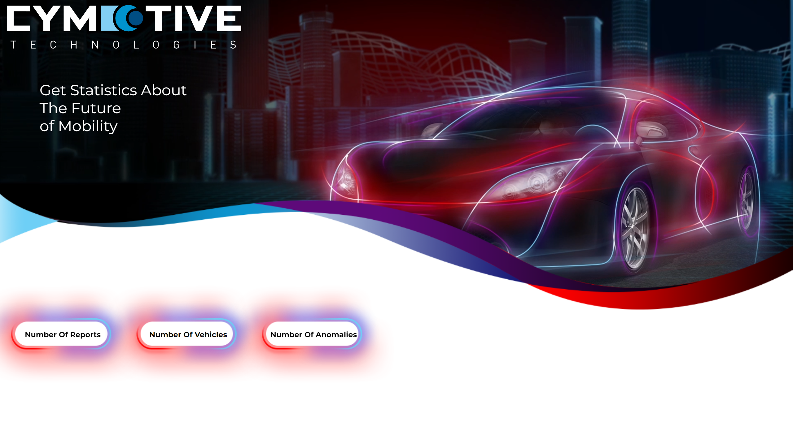

# Cymotive-AWS

this project is an Intrusion detection system (IDS) to detect anomalies in vehicles using AWS Cloud.
In this project I develop ETL (Extract, transform, load) data pipelines to gather data from a vehicle and put them into a single location to query and extract insights.
I used mock data reports located in the attached file called 'reports.json'.

## AWS - Services

### S3 - cymotive-reports-bucket

Created S3 bucket to storage all the reports of anomalies, with S3 default encryption

### Lambda - porter

Lambda function for dealing with http requests with report\s in json format and saving them in S3 bucket

### DynamoDB - ids-table

Created DynamoDB table for all the items from reports with `vehicleId` as <b>Partition key</b> and `label` as <b>Sort key</b>

### Lambda - ingest

Lambda function that invoke every time Object created in `cymotive-reports-bucket`, `ingest` read the selected file from S3, ingest the data and put it in the right format in `ids-table`

### Lambda - analyzer

Lambda Function that connects http request to query data in `ids-table`, can get Number of: <b>Anomalies</b>, <b>Reports</b>, <b>Vehicles</b>

### API-Gateway - idsgateway

allow to invoke lambda function through http requests.

<h3>end points</h3>

- <b>POST /</b> - send report\s in json format, invoke `porter`.

- <b>GET /numberofreports</b> - get number of reports, invoke `analyzer`.

- <b>GET /numberofanomalies</b> - get number of anomalies, invoke `analyzer`.

- <b>GET /numberofvehicles</b> - get number of vehicles, invoke `analyzer`.

## AWS-CDK

AWS-CDK allow me to upload a stack to `CloudFormation` using TS.
CloudFormation isn't simple service and to build template on my own is not recommended, with CDK i write TypeScript code that synthesize to template.

CDK has the option to test templates and not to deal with zipping Lambda and other services.
I've created all the AWS-Services above with CDK and not touch the Console, it help to maintain the stack and let other dev work on the project.

### CloudFormation - template

Simple Template:

## Front

Simple Front inspired by Cymotive - Official Website. Created with React With Mobile-first attitude.

## Tests

### CDK

CDK allow us test the CloudFormation template that generated from our code using `Jest`, I Tested:

- [v] Lambda - number of functions, correct env variable and names
- [v] S3 - bucket with correct name and correct encryption
- [v] DDB - Table with correct name and specified Partition\Sort key
- [v] ApiGateway - correct Stage name.

I've also implemented Unit tests for Lambda with the right\wrong events:

- [v] porter - function give correct response and body and fail without body or wrong event.
- [v] ingest - function collect event data, read S3 and succeed put item in DynamoDB. fail with wrong data.
- [v] analyzer - function return number of selected request

### E2E

- [v] Title - cymotive page title
- [v] Components - Page should render all components
- [v] Get Information - Click on specific Element should get the correct info(Numeric)

## Github Actions

### Tests

every pull request to `main` branch trigger github action that create CloudFormation Template and check if all the tests pass or not to give information to code reviewer

### Deploy Stack

every push to `main` branch create CloudFormation Template and Deploy it to the cloud.

## License

All the right reserved for @Cymotive
